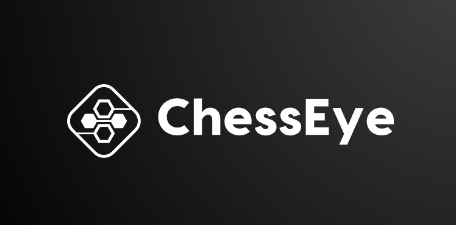
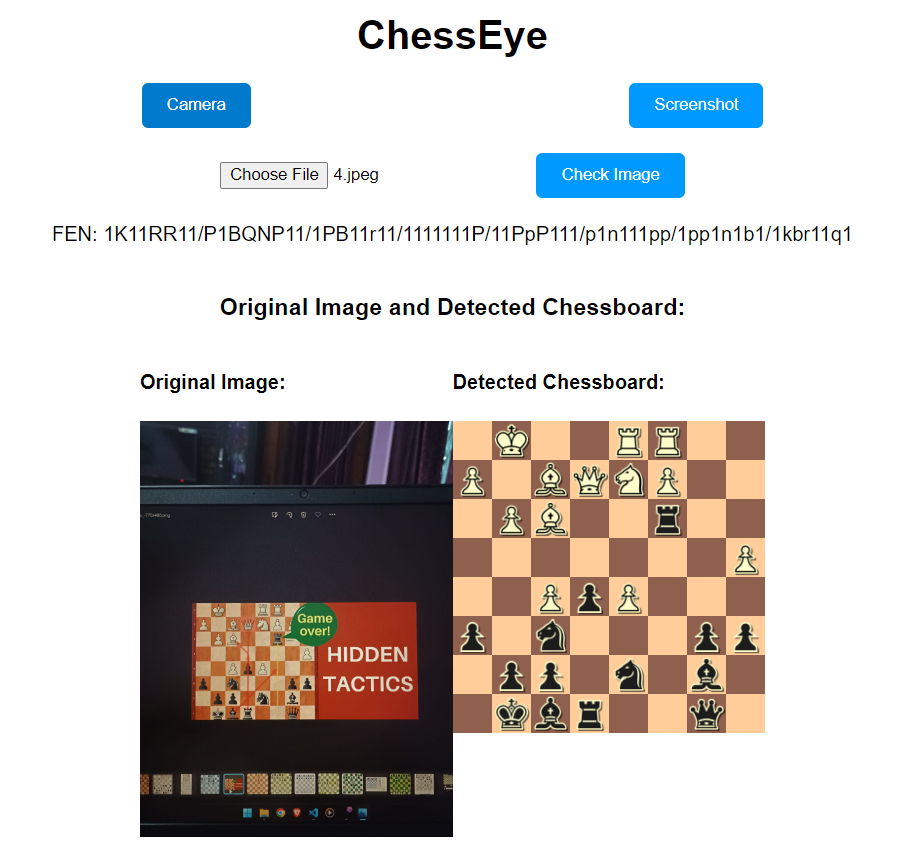
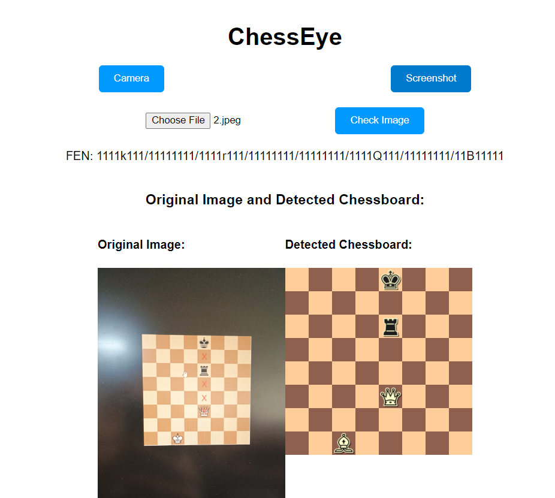

<a name="readme-top"></a>

<!-- PROJECT LOGO -->
<br />
<h1 align="center">ChessEye: Chessboard Detection and FEN Generation from Images</h1>
<div align="center">
  <a href="https://github.com/maskboyAvi/ChessEye">
    
  </a>
  <p>
    ChessEye is an AI-powered tool for detecting chessboards from images and generating FEN (Forsyth-Edwards Notation) strings with high precision.
  <br />
    <br />
    <a href="https://github.com/maskboyAvi/ChessEye/issues">Report a Bug</a>
    ·
    <a href="https://github.com/maskboyAvi/ChessEye/issues">Request a Feature</a>
  </p>
</div>

<!-- TABLE OF CONTENTS -->
<details>
  <summary><h2> Table of Contents </h2></summary>
  <ol>
    <li>
      <a href="#abouttheproject"> About The Project </a>
      <ul>
        <li><a href="#mission"> Mission </a></li>
        <li><a href="#valueproposition"> Value Proposition </a></li>
      </ul>
    </li>
    <li><a href="#keyfeatures">Key Features</a></li>
    <li><a href="#builtwith">Built With</a></li>
    <li><a href="#howitworks">How It Works</a></li>
    <li>
      <a href="#gettingstarted">Getting Started</a>
      <ul>
        <li><a href="#installation">Installation Instructions</a></li>
        <li><a href="#example">Example Usage</a></li>
      </ul>
    </li>
    <li><a href="#license">License</a></li>
    <li><a href="#contributing">Contributing</a></li>
    <li><a href="#team">Team Members</a></li>
  </ol>
</details>

<h2 id="abouttheproject"> About the Project </h2>

**ChessEye** leverages advanced computer vision and deep learning techniques to detect chessboards from images or camera feeds and convert them into FEN strings. This project helps chess enthusiasts and developers in accurately analyzing game states from various visual sources, facilitating game analysis, record-keeping, and AI development.

<p align="center">
  
  
</p>


<h3 id="mission"> Our Mission </h3>

Our mission is to empower chess players and developers by providing a reliable tool that converts any visual representation of a chessboard into a precise digital format. ChessEye bridges the gap between physical and digital chess, enabling seamless game analysis and continuation.

<p align="right">(<a href="#readme-top">back to top</a>)</p>

<h2 id="keyfeatures"> Key Features </h2>

- 📷 **Chessboard Detection:** Recognize and extract the chessboard region from images, even with varying lighting and angles.
  
- 🔍 **FEN String Generation:** Accurately convert the detected chessboard into a Forsyth-Edwards Notation (FEN) string for game continuation and analysis.

- ⚙️ **Live Camera Feed Analysis:** Analyze live camera feeds to dynamically detect and process chessboards in real time.

- 🎯 **High Accuracy with Deep Learning Models:** Utilize deep learning models for robust detection and FEN generation, ensuring high accuracy and reliability.

<p align="right">(<a href="#readme-top">back to top</a>)</p>

<h2 id="builtwith"> Built With </h2>

     

<p align="right">(<a href="#readme-top">back to top</a>)</p>

<h2 id="howitworks"> How ChessEye Works 🤔 </h2>

**Step 1: Chessboard Detection**
- Utilize computer vision techniques to identify and segment the chessboard region from the input image. This step involves detecting edges, lines, and patterns that represent a chessboard grid.

**Step 2: Chess Piece Recognition**
- Deploy a deep learning model trained to classify different chess pieces based on their shapes and colors. Each piece is identified, and its position on the board is determined.

**Step 3: FEN String Generation**
- Convert the identified pieces and their positions into a standard FEN string, enabling users to use the result for further analysis, game continuation, or importing into chess software.

<p align="right">(<a href="#readme-top">back to top</a>)</p>

<h2 id="gettingstarted"> Getting Started </h2>

<h3 id="installation"> Installation Instructions </h3>

To set up ChessEye on your local machine, follow these steps:

1. **Install Python 3.8 or higher:** [Download and install Python](https://www.python.org/downloads/) if you haven't already.

2. **Clone the repository:**

   ```bash
   git clone https://github.com/maskboyAvi/ChessEye.git
    ```
3. **Navigate to the project directory:**
    ```bash
    cd ChessEye
    ```
4. **Install dependencies:**
    ```bash
    pip install -r requirements.txt
    ```
5. **Run the application:**
    ```bash
    python app.py
    ```
<h3 id="example"> Example Usage </h3>
To see ChessEye in action, run the provided scripts with your preferred input (image or live camera feed). The output will be a detected chessboard with its corresponding FEN string displayed.

<p align="right">(<a href="#readme-top">back to top</a>)</p> <h2 id="license"> License </h2>
ChessEye is licensed under the MIT license. For more information, please see the LICENSE file in the repository.

<p align="right">(<a href="#readme-top">back to top</a>)</p> <h2 id="contributing"> Contributing </h2>
We welcome contributions! For detailed instructions on how to contribute, please refer to the Contributing Guide in our documentation.

<p align="right">(<a href="#readme-top">back to top</a>)</p> <h2 id="team"> Meet the Developer </h2>
Aviral Katiyar
<p align="right">(<a href="#readme-top">back to top</a>)</p>


